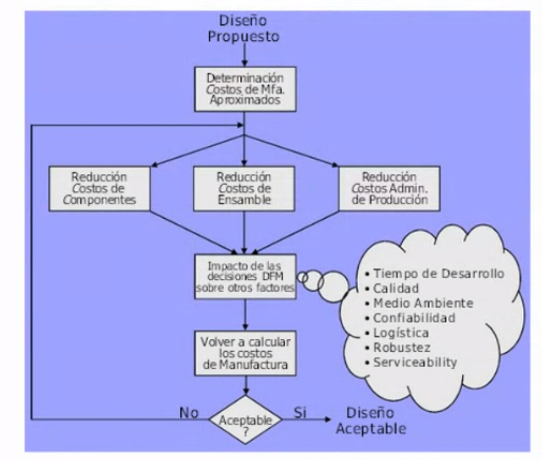
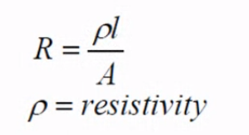
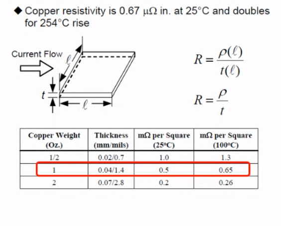
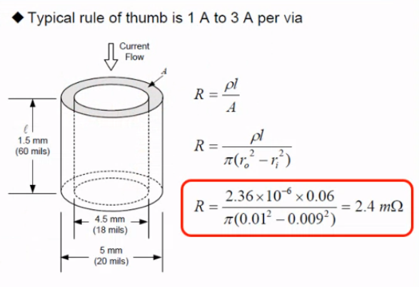
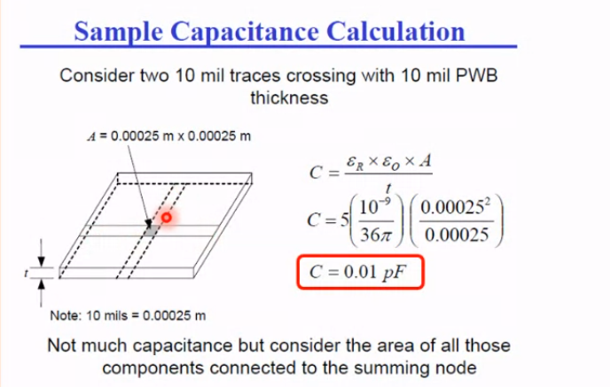
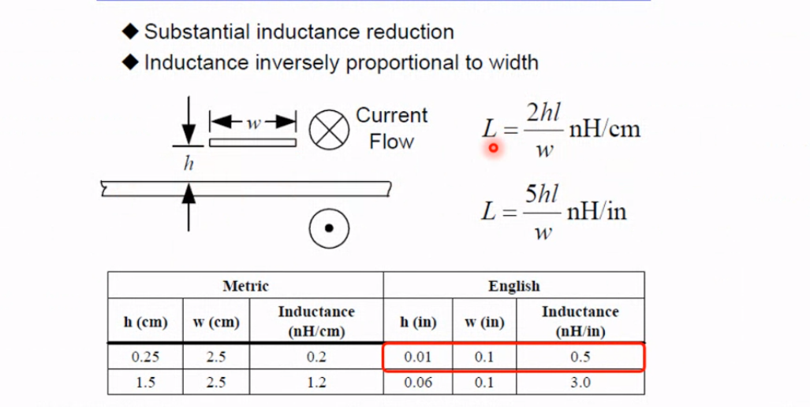

# Clase 01 - 27/02/2024

## Profesores:
- Sergio
- Juan Manuel

## Libro
Printed Circuit Handbook (Clyde F coomb, Jr), 

## Evaluacion
7 cuestionarios que se aprueba con 4

## Diseño para manufacturabilidad
- Surgen varias metodologias para resaltar el diseño. DFX seria design for X, en este caso DFM diseño apra la manufacturabilidad
- Diseñar las cosas para que alguien las puedas fabricar. Asi no solo el diseño es algo creativo sino que sea orientado par que alguien las pueda producir
- Si hablamos de manufactura hablamos de costos, ya que es importante para el margen de venta, aunque a veces el precio del producto final es mucho mayor o no depende del costo sino por lo que ofrece
- El costo depende directamente del volumen, siempre mientras mas se hacen mas barato sale en proporcion. **El costo es sensitivo al volumen**. El volumen permite la sistematizacion y asi requirrir a maquinas y asi se reduce mucho el costo. Mientras mas personas o mas trabajo artesanal encarece el producto
- Al tener mquinas, ganas velocidad, reducis costo, ganas confiabilidad
- La DFM casi siempre va a estar enfocar en reduccion de costos
- Por ejemplo en la pandemia cambio mucho como la gente se movia y lo que hacia y eso hizo que se modificaran los costos por tema de los semi conductores

### Informacion para que la aplicacion de la DMF sea existosa
- Bocetos , dibujos, plasmar en papal para eso despues lograr las especificaciones del producto lo que nos lleva a alternativas de diseño
- Para poder fabricarlo en escable es necesario saber el conocimiento detallado de los procesos de fabricacion y ensambles disponibles
- Costos estimados de manufactura, volumenes de produccion y tiempo al mercado.
- Para tener toda esta informacion se necesita gente de :
    - Ingenieria
    - Finanzas
    - Produccion
    - Diseño
    - Mercado

##  Diagrama de flujo

1. determinacion de costos de manufactura, como para partir de una base de un costo dentro del cual sea viable. La idea es arrancar de un estimado y hacer calculos y ver hasta donde se llega
2. Se dividen los costos para lograr reduccion de costos. Se divide en la parte fisica que es Componentes, ensamblado (equipameinto, mano de obra) y el tercero es Administracion de produccioon es todo lo complementario para tener los componentes, insumos y ponerlos en dinamica de produccion. Aca hay muchos gastos como, transporte, almacenamiento, los encargados de comprar, la logisiticas.
3. Una vez estimado lso costos, se analiza como las decision de que compomentes, como enasamblar, si uso un tercero, si lohacemos nosotros, si importamos algo. Todas esas decisiones impactan en calidad, tiempo desarrollo, todo lo que esta en la nube.
4. Se vuelven a caluclar los costos de manufactura a partir de las decisiones de DMF.
5. Cuando el resultado del costo es aceptable termina el diseño, sino se revisa. Esta buenot ener los costos ponderados, es decir que porcentaje involucra cada etapa o pase asi uno puede atacar a ese insumo o proceso.

## Linea de tiempo
- Revolucion industrial, maquina de vapor -> fines de siglo XVIII
- Radio/Electronica -> fines del sigo XIX
- Valvulas de vacio -> fines de 18XX
- Circuito impreso -> mediados del 193X
- Semiconductores -> inicio 195X
- Circuit integrado -> fines de 195X

## Manufactura
- Proceso de fabricacion de un producto que se realiza con las manos o con ayudas de maquinas
- Work Piece Indicatos(WPI), es ver la pieza para ver si esta bien
- El artesano hace una accion, analiza la reaccion de la pieza, observa el cambio y realiza otra accion y esta secuencia se repite. La maquina hace lo mismo pero con sensores, la idea es que uno le pase a la maquina como lo haria uno
- WPI: los inidicador van a ser los sentidos, vista, sonida, olor, tacto

# Modulos electrónicos

## ¿Que es un sistema embebido?
- Equipos electronicos que incluyen profcesamiento de datos
- A diferencia de una pc es que estos sistemas tiene una FUNCION ESPECIFICA
- Pueden estar conentidos en otro equipo. Es un sistema electronico contenido dentro de un equipo completoo
- Siempre implica desarrollo simultaneo de SW y HW
- La mayoria tiene como cerebro tienen un microcontrolador (SOC) Pero tambien el cerebro puede ser: 
    - DSP
    - FPGA
    - Microprocesador
    - ASIC

## Diseño de un sistema embebido
El diseñop generalmente se orienta a
- Reducir su tamaño, costo y consumo.
- Aumentar eficiencia, confiabilidad y re-usabilidad(para usar en distintos modulos).
- Mejorar su desempeño
- Asegurar determinismo: que se comporte siempre igual ante las mismas excitaciones
- Asegurar su tiempo de respuesta: siempre deberia responder en el mismo tiempo
- Atender la mayor cantidad de tareas posibles

## Requerimientos
Sea cual sea la funcion del embebido siempre tiene que contar con:
- Conectividad de uso corriente, usb, ethernet wifi, cosas comunes para el usuario. Muchas veces se tiene que agregar USB cuando con una uart ya hubiese sido suficiente
- Interfaces de usuarios en uso corriente: display, pantalla touch, etc

Para cumplir esos requerimientos es necesario contar con plataformas de rendimiento y recursos en crecimiento que permiten atender el incremento de procesamiento y asi poder atender a las nuevas conectividad y el usarios

## Potenica
La potencia implica consumo de energia y generacion de calor.
La potencia es la suma de la potencia estatica y la dinamica

- La potencia estatica es proporcional a la tension, por eso se paso de TTL a 3.3 o a 2.7, bajan para bajar este componente
- La potencia dinamica es proporcional a la frecuencia digitial (F) por el salto de tension digital al cuadrado (V), por eso cuando se sube la frecuencia aumenta la potencia pero los fabricantes van bajando las tensiones
- La potencia = k*v + c*F*V² /2

El calor viaja de la temperatura mas alta al mas bajo, por eso funciona el sistema de disipacion. En los semiconductores, tenemos componentes muy chicos con MUY poca capacidad de disipar calor, por eso  se lo ayuda para que el calor no se acumule en el componente

En cualquier diseño, hay que tener en cuenta: tension corriente y potencia por el calor. Los que generar mas calor **son los componentes que conmutan mas rapido**. Hoy en dias las herramientas hacen analisis de calor.

## Calculo de resistencia electrica
La tienen todos los material, es la resistencia que oponen al paso/flujo de electrones, la cuales se refleja en la constante de resisitividad y eso se ve afectada por la geometria del cuerpo

Generalmente vamos a encontrar, cobre, estaño-plomo, plata, etc. Donde la mejor conductividad la tiene la plata en este caso pero se usa cobre por el precio.

Osea que el estaño es mucho mas resistivo que el cobre. Pero igual te dicen de estañar las trazas/pistas para aumentar la conductividad, pero en realidad no es asi, osea si es verdad que al poner en paralelo se la resistencia es menore que la menor pero la relacion es 10 a 1, asi que es practicamente lo mismo. CONCLUSION: el estaños NO sirve para transoporte, solo sirve para unir.

Muchas veces algunas estaños tienen plata, para mejorar la conductividad. Se usa poco por el precio.

### Movimiento del calor en un traza, de un circuito impreso

Todo eso es a una temperatura y dimension estandar 

Los calculos de iorriente en un impreso, SIEMPRE hay que preguntar la temperatura porque como se ve en la tabla la RESISTIVIDAD cambia mucho con el aumento de la temperatura.

Lo mismo se puede hacer para un CILINDRO conductor o vias. 

Sirven para pasar corriente de una layer a otra. La resistividad de las vias suelen ser altas, pasamos de uOhm a mOhm. Por eso para altas potencias se suelen utilizar varias vias para la misma conexion para reducir la resistencia de la conexion.

### Generalmente en un circuito impreso
En una layer se hacen trazas mayormente verticale y en el otro horizontales, se hace eso para evitar la superposicion de pistas y asi reducir la capacidad, la mejor forma de reducir es el cruce ortogonal.

Para un trazado standar, la capacitancia es 0.01pf, en principio no es tan perjudicial pero si son muchas puede ser algo a mitigar
- Hay que evitar superoposicion para evitar el ACOPLAMIENTO capacitivo
- Cuando por las lineas/pistas circula alterna tiene comportamiento inductivo donde el factor mas importante es el largo, por eso deberia ser algo bastante corto y se recomineda hacer las pistas lo mas cortas posibles
- Ese inductor la atenua la señal por eso hay que evitarlo. Se podria decir que "frena" la señal. El tema no es tanto la amplitud sino mas la fase porque eso puede generar un desfasaje, entonces por eso hay que mantener la impedancia controlada para mantener la integridad de la señal. Por eso a veces se agregan viboritas o longitudes "innecesarias" para evitar el desfasaje en cosas sincronicas. Por ejemplo buses de pc para que tengan todas las pistas las mimsa longitud asi todos los bits llegan al mismo tiempo
- El ancho de la traza impacta pero esta dentro de logaritmo asi que no importa mucho

- Para mitigar esta inductancia parasita del trazado se usan planos de tierra, donde dependiendo la superpiosicion con el plano de tierra va a mitigar eso:

Como se puede ver, el ancho de superposicion esta dividiendo y por lo tanto eso ayuda a mitigar el efecto inductivo. Esto se debe a que la corriente fluye para un lado y en plano de tierra hacia otro.

### Temperatura que pueden gestionar los componentes
- Es un gran problema ya que cada vez son mas chicos
- El silicio a los 270 se raja
- El impreso soporta 160 grados como maximo
- Lo ayudamos dandole mas superficies o dandoles mas superficie
- 1 W termina dando mas o menos dando el tamaño de una tarjeta de credito para poder disipar si no uso un disipador

### Materiales para disipar calor
Hay que ver la conductividad termica
- El estaño-plomo tiene muy poca capacidad de sacar calor
- Epoxy de las placas son horribles conductores
- Por eso el calor se va a ir por las trazas, el cobre es de los mejores conductores de calor
- El aluminio es la mitad de bueno en conducir el calor pero el costo es mucho mas barato (el cobre tien 3.6 W/cmC°  y el aluminio tiene 1.8)

### Las placas que hagamos van a estar en contacto con el aire
- Hay que saber como es la conveccion del aire en donde estamos. La conveccion natural es hacia arriba, osea el aire caliente va hacia arriba. en un gabinete va a empezar a dar vueltas
- Generalmente lo mejores ponerlo en modo vertical por el flujo de aire y sino en horizontal pero con los componentes del lado de arriba

### EMC - compatibilidad electromagnetica
EMC: La compatibilidad Electromagnética es la capacidad de un producto para convivir en su entorno electromagnético determinado sin causar o sufrir degradación funcional o daños

EMI: Interferencia Electromagnética, proceso por el cual la energía electromagnética perturbadora se transmite de dispositivo electrónico a otro por caminos, radiadas o conducidas o ambos

- Los componentes no se van a comportar como ideales en el caso de frecuencias altas
- Esas impedancias parasitas que dependen de la frecuencias puede generar caidas de tension y corriente
- Es IMPOSIBLE predecir el cumplimiento pero si reducir el riesgo mediante algunas tecnicas y reglas de diseño
- Se busca disminuir la emision y endurecer el sistema electronico ante las señales electromagnetica
- Puede ser radiada (por el aire) o conducida (a traves de un solido)
- Los elementos en un modelo EMC son:
    - fuente de ruido
    - la victima
    - ruta de acomplamiento
- Hay que detectar la fuente y la victima del ruido.
- Identificar la ruta de acoplamiento para poder atenuar
- Modos de acopĺamiento (caminos):
    - Conducido: corriente electrica, vcc, GNDF, señales
    - reactivo: inductivo (campo magnetico) (grandes corrientes) o capacitivo (campo electrico) (grandes tensiones)
    - Radiado: campo electromagnetico
- Para mejorar la calidad de diseño EMC hay que analizar el entorne EMC
- Hay que prestarle atencion al pulso digital, ya que eso afecta el crecimiento y decrecimiento del pulso (esto no entendi mucho)
- En RF esta el campo cercano, campo lejano y campo de transicion. 

## Considerar detenidamente:
- Metodologia de trabajo
- Conocimiento diseño electronico
- Dibujo de circuito impreso
- Tecnologia de componentes
- Tecnologia de componentes
- Tecnologia de producto
- Fabricacion del circuito impreso
- Fabricacion del producto

## alineamiento
- Simplicidad, hacer las cosas simples, 
- Excelencia, satisfacer al clientes
- Documentarse debidamente y saber filtrar/tamizar
- Metodos de trabajo

- Los sistemas embebidos son HERRAMIENTAS que permiten ofrecer soluciones a aplicaciones antes resueltas o no mediante el uso de otras tecnologias y tecnicas
- Los circuitos cada vez son mas sofisticado 
- Establecer campo de aplicacion, requerimientos: gestion de corriente, potencia, tension.

## Densidad de Interconexion
- Assembly: dificutlar de ebnsamblar componentes
- Component: grafo de sofisticacion de los componentes
- Printed wiring board: densidad de cableado de la placa

Todo esto condiciona cosas como:
- Material y cantidad de layers
- Dimension de trazas/pistas
- Distancias
- Disposicion
- entre otras cosas

Para pasar de un diagrama esquemático a un circuito impreso confiable de simple fabricación, armado y prueba es preciso recurrir a normas técnicas de referencia. Esto se debe a que hay que tener en cuenta:
- Consideraciones relativas a disposicion de componentes
- EMC
- formas y dimensiones de pistas

## Normas
- Vamos a usar las normas IEC e IPC, donde IPC (Association Connecting Electronic Industries) es la maxima autoridad en el diseño. No depende de ningun estado
- La aplicación de normas del IPC garantiza el buen funcionamiento electrónico del producto final.
- Son guias, estandares, referencias y te permiten entender conecper, minimiza tiempo, obtener excelencia en el prioducto final, generar metodos, mejora de diseños entre otras cosas.
- Pra aplicar las normas es fundamental clasificar al producto. Las normas tienen clases en rendimiento (normal es nivel 1) y clase en nivel de productividad (normal es nivel B)

## El proceso de diseño del PCB
El objetivo del proceso de diseño de PCB es diseñar un PCB que:
- Funcionen correctamente en todo el rango de variaciones de
    - velocidades
    - temperatura
    - tension
    - tolerancias
- Producir toda la documentacionj y datos necesarios para
    - fabricar
    - ensamblar
    - probar
    - solucionar posibles problemas
