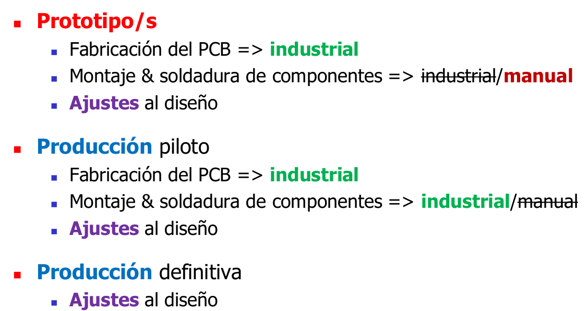

# Clase 02 - 5/03/24
Primer custionario 8/10

# Herramientas Informaticas
- CAE: para hacer ingenieria, circuito, simulacion, etc
- CAD: para el diseño, lo mas fisico ej circuito empreso (ahora igual viene todo junto)
- CAM: para la manufactura

Varias herramientas permiten vincular esquematico con circuito impreso y mantenerlo actualiazdo. Estas herramientas posibilitan aplicar una metodoliga de trabajo que asegura la PORTABILIDAD del diseño permitiendo el postero uso.

Programacion modular, se aplica en el diseño de hardware de electronica, conviene porque tiene la ventaja
para hacerlo portable y usar de un proyecto a otro

## Pasos del proceso de diseño
- Hay que usar metodologias de trabajo -> paso a paso entre los proceso
- Comienza con las especificaciones del producto del final deseado
- Termina con el almacenamiento del diseño
- Diseño correcto desde el primer momento, para eso se usan herramientas informaticas
- El proceso basico es lo mismo tanto para PCB analogicos o digitales
- La diferencia en el proceso de diseño para las dos clases de PCB se centran en torno a las diferencias en la COMPLEJIDAD de estos dos tipos de circuitos
- En instancia de diseño hay que hacer todos los chequeos para ver que todo cumple

## Dibujo del esquema eléctrico
### Recomendaciones para trabajar en estructura modular
- Crear un diagrama de bloques del circuito de sus principáles funciones para mostrar
    - como se ha particionado el sistema
    - como se relacionan entre si
- Dentro de cada bloque tengo que poner (crear conexion detallada entre los componentes de cada bloque)
    - Los componentes que formar parte de ese bloque
    - Interfaces de comunicacion
    - fuentes, etc
- **Adecuar cada compomente al que usara realmente, no usar genericos**
- Si no esta el compomente acomodar alguno parecido hasta cumplir con el **100%** de ese compomente
- Generalmente en los CAD hay para chequar ER (electrical rules)
- Identificar a las conexiones criticas asignando nombres y a las lineas importantes (no solo GND y las tensiones sino tambnien las otras)
- Todas las verificaciones evitan problemas, hacer las maximas posibles
- Una vez que esta todo chequeado, uno genera la netlist (lista de conexiones en archivo de textos)

## Dibujo del circuito impreso (PCB)
- Siempre comenzar por el calado, con las cotas, puntos de sujecion, porque eso CONDICIONA lo fisico
    - **Mecanica condiciona lo electrico**
    - Te suelen decir que dejes una banda sin cobre en los bordes de la placa (esto es porque se fabria un panel donde hay muchas placas)
- Adecuar el compomente al real, igual que antes pero ene ste caso ADECUARLO AL 100% a las siguietes estandares IPC
    - PTH: IPC 7251
    - SMT: IPC 7351
- Respetar las DR Design rules, son reglas de proximidad, distancias minimas, diametros minimos y maximos
- Validar el CAD con el modelo 3D
- Determinar grillas (esto facilita todo) para componentes, trazas, pads, vias segun
    - IPC 7215
    - IPC 7351
    - Especificaciones del fabricante del pcb
- Determinar las dimensiones adecuadas de: (IPC 2152)
    - trazas (transportan corriente y calor)
    - pads y vias (intentar menos perforados ya que se hacen con distintas mechas y eso demora el tiempo de produccion). **Acotar variedad de perforados**
    - Textos de los componentes
- Determinar separacion mínima (IPC 7215 & 7351)
- El aire es mucho mejor aislante que el dielectrico, por eso se hace los cortes 
- 

- Dividir en bloque funcionales o areas de trabajo
    - Bloque a bloque se facilita todo
    - Resolver un bloque a la vez, comenzando con conexiones criticas. Ayudar a las fuentes o victimas de EMI con planos de tierra
    - Disposicion de components/layout para minimizar la EMI, optimizar el trazada y el enfriamento de componentes que generan calor
    - Orientar y alinear en patrones simetricos y ortogonales, ya que eso es mas facil para soldadura, localizacion, lecutra, dibujo y re uso
    - colocar **fiduciales** (marcadores) para montaje automatizado. Estan puestos en lugares estrategicos y son asimetricos para que las maquinas que montar compomentes se puedan posicionares
    - Colocar testpoint y pattterns para verificacion y puesta a punto. Los patterns son pedazos de placa donde se copia una conexion critica del impreso ej una traza que tiene que tener una cierta impedancia. Entonces en el patern copio esa parte con punto para inyectar señal (obvio todo esto esta fuera del area util ed los impresos) y asi corroborar
    - Tester tienen puntas pogo pins que tiene un restorte metido adentro
    - Evaluar ruteabilidad para acotar numero de layers/capas
    - Acotar:
        - la frecuencia maxima que ande dando vueltas. Aunque algo pueda ir a alta frecuencia, si no lo necesita no usarlo
        - La longitud de traza
        - el numero de vias
        - el efecto de lazos magneticos
    - **SIEMPRE PROVEER un vinculo de conexion concentrado entre la fuente y las cargas**. Generalmente la fuente es lo mas imporante de la placa, sin eso no funciona nada. Ademas la fuente se conecta con TODO. Por eso, uno tiene que prestar atencion en como se conecta esa fuente con cada una de las cargas. Entonces uno puede utilizar capacitores de desacople si hay vinculo de conexion conectrado. sino es dificil mitigar el ruido por conmutacion. Osea poder medir y desacoplar cada modulo. Como se si un capacitor cumple con el desacople, basicamente tengo que medir la tension con un osciloscopio para ver la salida de la señal y ver el ripple de la fuente. Simplemente hay que ver que bajen el desacople. Osea basicamente esa placa en el primer prototipo uno prueba para cada modulo, cortando y soldando pistas y ver si sirve para todos los modulos los capacitores de desacople
    - Ir aplicando las DRC a medida que avanza
- Utilizar simuladores 
    - para temporizacion e integridad de señal. Por ejemplo los retardos y reflexion en lineas de transmision
- Verifica dibujo que no haya
    - superoposicion de planos de tierra para evitar elementos capacitivos, porque aunque sean continua igual trae ripple
    - superposicion entre componentes, soldadura y pintura
    - Desquilibrio entre conexion de pads, sino un pad permite mayor fuga de calor rapido va a ser mas dificil de soldar, por eso las pistas mas finas se pueden soldar mejor
    - Evitar Areas sin conectar, sino conectar a tierra para evitar inductancias parasitas
    - Intentar distribucion homogenea de cobre
- Hay que panelizar el impreso, es decir, determinar el tipo de corte de placas
    - Hay que aprovechar al maximo
    - Panelizar minimiza costos
    - El costo de las placas es por cantidad de capas y por cantidad de placas
    - El panel maximo puede ser 18 x 24 pulgadas usando PCB de 6 capas (occidente)
    - En oriente son 4 veces mas grande, por eso son tan baratas
- Hay generar y verificar los archivos de manufactura (gerbers)
    - archivos de impresion fotografica p
    - pick and place

### Generacion de archivos de manufactura
- El desarrollo del producto se basa en el "Design For Excellence"
- Cada desarrolador de producto tiene su metodo y equipameinto de desarrollo que ACOTAN su CAPACIDAD de desarrollo
- El producto desarrollado dependerá ufertemente del CONTEXTO qn que se lleve acabo

Manufactura: procesod e fabricacion de un propducto que se realiza con las mano o con ayudas de maquinas. Estan los Work Piece Indicators (WPI) donde a aprtir de los indicadores uno realiza una accion, despues de esa accion vez la reaccion de la pieza, observas el cambio y volves a realizar una accion. WPI uno puede observar los cambios mediante: vista, sonido, olfato, tacto.

### Para garantizar el existo sera necesario:
- Prototipo lo usual es tener un PROTOTIPO en 3 intentos, pero lo ideal seria un PRODUCTO en 3 intentos
    - Lo ideal seria que desde el primer prototipo ya sea de nivel industrial. Se tarda mas pero bueno pero una vez que ya esta finalizado, estas mas cerca del diseño final. 
    - si lo haces soldar por el mismo que lo fabrica o por quien lo va a soldar vas a tener un nfeedback del prototipo, entonces sirve
    - Produccion piloto, aca ya va a ser todo industrial
    - Produccion definitiva

Ahi estan los 3 intentos de la produccion definitiva

### infortmacion del fabricante para configurar las herramientas de diseño
- grosor de placa
- espaciado
- minimo del diametro del agujero, etc

- Siempre lo que te da por default es lo de mas bajo costo y lo que tiene menos error. Por eso hay que intentar ir por ahi
- Sharped Corner Pads are not ggood for RF design

Satrun desing, hace el caluclo de las caracteristicas electricas de continua

- Segun la pata depende la cantidad de estaño. La 7351 es la que define los pads
- Las norma 7351 arranca siempre por las dimensiones mecanicas del componente
    - a ese compomente hay que dejarle cierto espacio alrededor
    - y enfuncion de eso recomienda el tamaño de los pads
    - tambien area libres respescto a otros compomentes

- el pie (toe) es la parte pata donde apoya en el pad
- Hay que saber que es el pie y que el dedo ya que hable de eso en la norma
- Hay que evitrar que la maquina gire asi no erra

### Proceso de soldadura
hay una curva donde primero hay un precalentamiento, despues hay una proceso de soldadura
A esto se lo denomina perfil de soldadura
- zona de precalentamiento - 150°C
- zona de activacion - 150 a 200 °C de 60 a 80 s
- zona de fundicion 240 a 260 °C de 10 a 20 s
- El enfriamiento es maximo 4°C/seg

- Esto es clave para poder soldar todo de una.
- El horno es una cinta transportadora que somete a todo a la misma curva de calentamiento. A todos componentes por igual.
- Primero hayu una fase pastosa, eso pasa cuando la sacas muy rapido (soldadura fria)
- Hay un estaño que no pasa por mesa fase pastosa
- La humedad acumulada en componentes puede romper las capsulas
- La temperatura cambia del comportamiento del aisalante, como la expansion
- Punto Eutectico: El punto eutéctico es la temperatura más baja a la que puede fundirse una mezcla de sólidos con una composición fija. Es también la temperatura con el punto de fusión/solidificación más bajo posible en el diagrama de fases

Uno tiene que tratar de tener una distribucion pareja de cobro como se ve en la de abajo a la derecha 

Para la soldadura por ola hay que montar los componentes de cierta forma. Como se ve hay que ponerlo de tal forma que las patas queden "cortando la ola". Ortogonales a la ola

- La norma viene con dibujos y tablas donde te dice lo recomendado
- Te da la Nomenclatura
- En la tabla se ve como lo aceptable es cuando solamente sale una pista del mismo tamaño tanto de ambos patas.
- En el primer caso la pista ancha directametne no va a solda porque se disipa el calor

- Fiduciales, R de cobre y un diametro 2R libre de cobre
- Se suele poner en componente de paso finos, en las diagonales y cruzado al pin 1
- Hay una zona de exclusion para los test points

## Recomendaciones
- Reducir la generación de ruido y aumentar la inmunidad al ruido (radiado y conducido)
- Frecuencia máxima del sistema
    - Optar por la menor frecuencia de trabajo posible
    - Adaptar la tecnología a las limitaciones del sistema
- Lazos magnéticos
    - Reducir su superficie
    - Mantener las trazas de señal lo más cercanas a trazas de tierra
    - Reducir los lazos de oscilador y cristal
- Campos Magnéticos
    - Oponer lazos magnéticos
    - Elegir encapsulados con pines de alimentación y tierra lo más próximos posible y con varios pines de alimentación y tierra ubicados en lados opuestos del encapsulado
- Inductancias Parásitas
    - Acortar la longitud de las trazas
    - Usar planos de alimentación y tierra
    - Adaptar las capacidades de desacople a la frecuencia de operación
    - Acortar la longitud de las trazas de conexión a los capacitores
    - Optar por los encapsulados más pequeños
- ESR “Equivalent Serie Resistance”
    - Colocar capacitores en paralelo para reducir la ESR
    - Elegir capacitores con dieléctrico de bajo ESR y buena estabilidad térmica
- Fuente de alimentación
    - Separar la tierra de la fuente de alimentación de la tierra de los dispositivos que la cargan
    - Proveer de un vínculo de conexión concentrado entre ambos
- Blindajes y puesta a tierra
- Componentes especiales
- Utilizar Grillas para
    - Posicionar componentes
    - Posicionar trazas, pads y vías
- Dimensionar adecuadamente
    - Trazas
    - Pads y vías (perforaciones con dimensión de perforado final acotando la variedad de perforado)
    - Textos (relación altura/ancho de la traza)
- Respetar Separación Mínima
    - Entre trazas, pads y vías
    - Entre componentes
- Comenzar por el contorno de placa y calados:
    - Dejar una banda sin cobre en los bordes de la placa
- Dividir el dibujo en bloques funcionales o áreas de trabajo:
    - Resolver un bloque a la vez
    - Identificar las conexiones críticas y comenzar por ellas
    - Terminado un bloque reubicarlo
    - Terminados todos los bloques interconectarlos
    - Terminada la interconexión realizar una Revisión General
- Trazas
    - Deben ser lo más cortas posible
    - Pasar por (o partir desde) el centro del pad o vía
    - Tener quiebres a 90º (facilita el trazado) o 45º (minimiza el área de
    - dibujo). Sugerencia: comenzar a 90º y pasar a 45º
    - No usarlas para rellenar áreas de cobre Usar la traza del ancho adecuado o “Fill” / “Poligon”
    - Usar varias vías de paso en trazas de alto consumo que pasan de capa “layer”
    - Refuerce las T´s con V´s
- Distribución homogénea de cobre
- No dejar áreas de cobre sin conectar ni colocar vías debajo de un componente
- Mantener la simetría en la distribución de componentes y en el trazado
- Aprovechar los pads para interconectar capas “layers”
- Prever puntos de prueba “Test points”
- Aplicar el DRC “Design Rules Check” a medida que se avanza en el dibujo y modificarlo hasta ver que lo pase
- Tratar que alguien revise el trabajo
- En el proceso (DFE) intervienen usualmente …
    - desarrollador de producto …
    - proveedor de componentes …
    - fabricante de impreso …
    - armador de módulos electrónicos …
- cada uno de ellos tiene su propio conocimiento, experiencia, recursos, equipamiento, métodos de trabajo, etc. , etc. que acotan su capacidad de brindar soluciones lo que configura una cadena tan débil como el más débil de sus eslabones.
- Armar la cadena antes de dibujar el PCB

## Conexciones de fuentes concentradas

- Si vamos a distribuir power lo mejor es el single point. si no se puede hacerlo en estrella. La peor de todas es el multipunto, porque asi es muy ruidosa porque cada punto le agrega ruido
- es decir el sistema multipunto (source multipoint) es mala en todas

En todas las otras fotos lo de la izquierda esta mal, lo de la derecha bien

- PSU: power support uinit, 
- lo mas cercano a la fuentes tiene que ser los circuitos que conmutan a alta velocidad porque son los que mas ruidos producen
- Evitar solapar planos de alimentacion
- Hacer que los que se solapen esean ortogonales
- No dejar areas conductoras sin conectar
- Eliminar los loops en supply lines
- isolate individual systems
- decouple suplyes lineas at local voundioiryes
- tener en cuenta que los capacitores de desacople, a medida que aumenta la frecuencia, se comportan como inductores, asi que ojo con eso
- separacion minima de 0.25mm

- Comenzar por el contorno de la placa y calados (cotas mecánicas y puntos de sujeción)
- Si partimos de un gabinete dado, usualmente copiaremos su geometría/dimensiones internas (total o parcialmente). Si tenemos libertad de elección, podemos optar por medidas
estándar (IPC-2221)
- Dejar una banda sin cobre en los bordes de la placa
    - Edge spacing (IPC-2222 10.1.1)
    - = Electrical Conductor Spacing (IPC-2221 Table 6-1) + 0,4 mm
    - “p/PCB deslizable” como mínimo 1,25 mm de distancia a la guía o Electrical Clearance
    - Recomendación de fabricante de PCB => 0,3 mm

Nuestra placa oscila a 180 MHz, todo lo que este cerca del nucleo va a estar expuesto a esa frecuencia dando vuelta por ahi

Pagina 86 links para descargar los materiales
