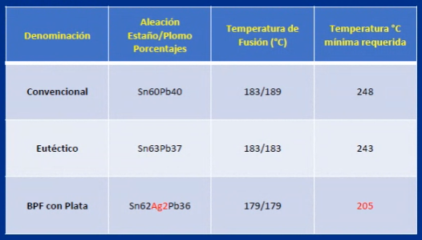

# Clase 03 - 12/03/24

# Soldadura manual - Principios basicos

## Que es una soldadura
- Es la union de dos superficies metalicas realizadas con un metal fundido que tiene 2 propositos
    - Una conexion electrica estable
    - una union mecanica duradera
- THT: through hole tecnology
- Para evitar la oxidacion se metaliza el cobre
- Siempre hablamos de Estaño-Plomo
- Hay otro tipo de placa con cobre expuesto que se le pone algo para que el cobre no se dañe. Esto se hace porque el metalizado puede que salga mal y que no sea perfecta esa metalizacion y puede traer algun problema
- Tipos de placa
    - SEM: como un cartos prensado, mucho mejor que el pertinax. No disipa bien el calor, ejemplo sirve para LEDs
    - Fibra de vidrio, es la mas comun (FR4)
    - Metalica, metal-core, esto es para potencias
- Puntos de soldadura no exponer entre 3 a 5 segundos

## Metodo manual
Los mas comunes son:
- Conductividad -> transferencia, bajo costo, shock
- Convectiva -> chorro de aire o gas caliente, proloijidad daños perifericos (poco control al flujo y a la temperatura)
- Radiacion -> IR Laser RF, alta calidad altos costos. Esto es para SMD o BGA

## Caracteristicas
- Espesor y diametro de pista
- diametro y longitud del orificio pasante
- Tipo de orificion
- Diametro y posicion del terminal
- Masa termica de la unico o del componente
- Revestimiento que pudiera tener
- Tipo de componente a soldar

## Fuerzas 
- Tension superficial - en SMD
- Capilaridad - Cuando sube y se agarra a la pata
- Gravedad, la gota siempre cae, tenerlo en cuenta par distintos procesos

por ejemplo muchas soldadoras tiene una ficha banana para ponerte una pulsera y cancelar la estatica
Las capas se llaman
- Top 
- Bottom  o del lado de la soldadura.

## Defectos habituales en una soldadura
- Soldadura fria: poco tiempo o temperatura
- Exceso de estaño: Eso puede ser por la mala eleccion de la geometria de la punta
- Deficiencia en el estaño: Falta de limpieza, calentamiento o mala eleccion del estaño
- Daños en pistas o terminales: Sobrecalentamiento o geometria incorrecta de la punta
- Daños del compomente: sobrecalentamiento o componentes considerado critico (CMOS) o entre otro falta de proteccion antiestetica
- Crateres o porosidad: temperatura o estaño incorrecto, falta de limpieza

El mayor problema es la soldadura fria

### Sugerencias con componentes criticos (CMOS)
- bajar la temperatura lo maximo posible, esto teniendo en cuenta el valor mini posible
- soldar en forma discontinua sus terminales, aca por ejemplo se puede soldar primero las patas impares y luego las pares
- Procurar tener sistemas antiestatico eficaz

### Buena soldadura
- Brilloso y Homogeneo es sinonimo de buena soldadura. En ingles se lo llama Wetting.
- NO poroso

## El cautín = soldador electrico
Es un lapiz, herramienta, para soldar. Usamos 20-30W no mas
- El convencional, es simplemente una resistencia electrica y eso calienta la punta y le transifere la temperatura.
- La punta suele ser conica, casi una aguja. Entonces yo puedo tranferir pero la superficie de contacto es menor
- Debido a la falta de punta, es mucho mejor la estacion de soldadura sin importar que sea china
- Los profesionales TIENEN control de temperatura. Tiene un sensor de temperatura en la punta que hace mandar mas corriente para evitar que caiga la temperatura

## Metalurgia de la soldadura
La importancia del control de temperatura:
- A la temperatura correcta vas a amalgamar los metales
- Si me paso de temperatura o tiempo ocurre que se crea una disfuncion intermetalica. Entonces unido se empieza a lastimar el metal
- Al menos 15° del punto de fusion son los que te dan la posibilidad de pasar a liquido en poco tiempo. POor eso es siempre bastane mas la temperatura porque entre todos los metales y las uniones se pierde
- Hay que ir a la temperatura minima posible e ir subiendo de 15 a 15

## Eleccion de la punta
- La conica/aguja es para sacar/quitar cortocircuitos (conica 0,4 o 0,8) (mejor ir por 0,4)
- La plana no se para que sirve
- Chisel 1.6mm es la CORRECTA para soldar
- La mini ola sirve para soldar smd

## Proceso de soldadura

## Con que se limpia
- Esponja vegetal HUMEDA, quno tenga agua, pero que este toda mojada
- virulana
- Para evitar problemas hay que guardar la puntas estañanda

## Puntas para desoldar
- Una mala maniobra en THT en multiplaca y se ARRUINA la placa para siempre
- Se usa una pistola que caliente y supongo que chupan al mismo tiempo
- Con tener 0,76 y1,02 ya cubris casi todo

## Flux
- Resina que quita de la pista y de la pata el oxido
- Tipos:
    - Flux gelatinoso, eso es con BGA
    - Liquido en lapiz
    - Liquido

## El estaño
- Eutéctico: punto donde la fusion de liquido a solido es el mismo
- en la temperatura de fusion el primero es solido es segundo liquido, en el medio es lo que queda pastoso. QUEREMOS EVITAR LA SOLUCION PASTOSA. En este eutético no tenemos ese problema porque aca pasa de solido a liquido. Si pasa a liquido suelda, no hay solucion pastosa, entonces no hay soldadura fria.
- La plata ayuda mucho en la ultima columna
- La temperatura minima requerida. Esto es porque para hacer que funda se necesita 15 °C de lo que dice el punto de fusion. Es la desviacion sobre el valor real. Ya que eso para fundir aunque sea unat emperatura y se diga que son 15 grados mas eso es en un domo al vacio
- Basicamente esa temperatura minima se refiere a la temperatura práctica a la que se debe calentar la aleación para asegurar una fusión completa y evitar problemas durante el proceso.

- Como tenemos perdidas por distintos factos
    - Masa terminca de la punta (5 a 35 °C)
    - contacto entre metales (3 a 10 °C)
    - Temperatura en atmosfera
    - Suciedad en pista, punta o pata (de 10 a 20 °C)
- Teniendo en cuenta eso que el rango de temperatura tiene que ser entre 265 °C y 321 °C

## Slide 39
LEERLA PORQUE VA A HABER UNA PREGUNTA DE ACA de libre de plomo
- NO HAY NADA parecido eutectios sin plomos, no hay nada que sea comparable al plomo
- SAC305 estaño plata cobre, 3 es la plata el 05 es el cobre y lo que falta es el estaño (claramente va a tomar esto)
- Si pone 96.5, el resto es 3 y 0.5. NO HAY aleaciones distintas con ese porcentaje de estaño
- el SACx0307 es una estabilidad PARECIDA a la SAC305
- La 405 es superior en precio, plata todo, que es para condiciones especiales 

# Marcas
Cautin: Goot
Estacion de soldadura: Quick