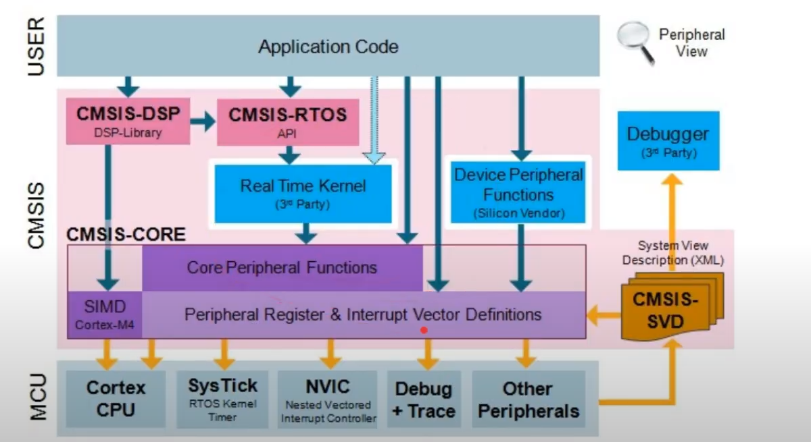

# Clase 01 - 01/03/24 - Programacion de microcontroladores

Primer y unico que se ven cuestiones de programacion
- Vamos a hacer un repaso de C
- Vamos a hacer revision de pares
- Tambien vamos tener practica todos los jueves
- No hay correcciones por parte del chabon, es algo para ir practicando nosotros
- En algunas materias (sobretodo de maestria) donde se va a programar sobre el kernel de linux

## Introduccion a la cursada
- Pagina web: https://sites.google.com/cursoscapse.com/pdm/
- Docente: Patricio Bos
- Hay practicas obligatorias que tiene que estar en un GIT personal
    - Hay que hacer un fork del repositorio (esto ya lo hice)
    - Todas las practicas se puede hacer hasta 72 hs despues (lunes a la mañana terminado)
    - La idea igual es terminarla en clase
    - El lunes nos mandan la revision de pares y eso despues se entrega
    - PARA APROBAR hay que tener las practicas obligatorias y la revision de pares
- Calificacion final, hacer las cosas e tiempo y forma y que hagamos un trabajo integrador para terminar la materia

## Trabajo practico practico final
- hay tp final
- es recomendable que este relacionado con el trabajo practico final 
- hay una planilla para la propuesta
- existe un documento para las pautal
- hay una planilla para eun reporte que hay que entregar con el codigo
- CLASE 8 se entrega!!!!
- El tp tambien se puede entregar para protocolos de comunicacion solo que aca se va a hacer mas hincapie en algunos aspectos y en otro otros aspectos
- La idea es hacer algo en la apllicaction level y que eso se comunique directamente con la HAL. oseea el middleWare lo hagamos nosotros

## Aprobacion
- Hacer TODAS las practicas de acuerdo al cronograma
- Tener git completo
- Hacer todas las revisiones
- entregar plan de trabajo en la clase 5
- demo de trabajo en clase 8
- repo del tpf al git

Embedde Gurus

## Herramientas
- tiene un debbuger incorporado la placa
- Links a todos los recursos utiles de la placa
- La placa tiene RTC  para despertar de low power
- Vamos a usar el IDE del fabricante
- el toolchain esta basando en GCC y GDB
- tiene un CubeMX que es un asistente grafico para inicializar, pero no esta bueno es demasiado magico y uno no aprende, asi que no lo vamos a usar. Si uno lo usa se nota muchoporque quedan marcas en el codigo

## Emuladores de terminal serie
cutecom
screen

Te propone una HAL y vamos a construir sobre la HAL, la idea es tener algo para salir rapido, puede tener error claramente y se han encontrado. Soluciona la primera vez, eso no significa que uno no pueda mejoprarlas o haga la suya. Es basicamente eld river
- Low lever apis
trae, middle ware, esta entre la HAL y la aplicacion del usuarios
- El primer paso con una placa nueva, siempre hay que ver los ejemplos del fabricante

MISRA-C:2004, es un standar para C y C++ para la confiabilidad del software
Ejemplo que variables locales siempre tengan asignado un valor antes de usarla

## Modelo de capa del STM
mientras mas arriba mas lejor del 

BSP - Packete de soporte para la placa, por ejemplo acceder a cosas de la placa como el pulsador, las palcas.

capa intemredia el middleware, generalmente esta provisto por terceros
en paralelo estan las utilities

- Nosotros programamos en el application level demostrations

## CMSIS
Cortex microcontroles software interface standar para ARM cortex
Es un conjunto de codigo/interface  standarizadas donde MUCHOS fabricantes de silicio se pusieron de acuerdo, que ahcen que la INTERFAZ HAL sea independiente del fabricante.
No es un cuento de hadas, trae problema pero es mucho mas facil con esto

Estructura de capas:

NVIC vector de interrupciones vectorizadas y anidadas, Hay interrupciones que se pueden interrumpir. Puede haber una interrupcion adentro de otra
En la parte de CMSIS hay uchas librerias y APIs para la aplicacion de usuario
La Hal de STM contiene CMSIS

## Estructura de archivos
- Carpeta con drivers
    - soporte a nivel de placa board support package
    - el CMSIS
    - Core: tabla de interrupciones
    - Archivos de HAL -> driver de hal, los c y los h, en los c suele tener algunos datos
- Vamos a tener dos carpetas ademas
    - Inc para los includes
    - Src para los archivos fuentes
- En la carpeta startup vamos a tener donde esta definido el stack pointer el program counter, la tabla de interrupciones y la llamada al main

Vamos a trabajar en inc y src, y ademas en la carpeta driver vamos a agregar una carpeta llamda API donde volcamos nuestros modulso de sw para trabajar mayor nivel de abstraccion. API: es una interface entre el programa y la aplicacion. Lo que esta entre la HAL y lo que esta en nuestra aplciacion de usuario que estara en el main

Esta estrucutra no es la que genera el cubeMX, por eso la idea no usarlo
- Las practicas son un copy paste de este proyecto

## Estrucutra minima que tiene un codigo
el main, es donde salta el program counter cuando termina el inicio
esto es cono cido commo superloop
primero algo de inicializacion, y despues queda en u while

## Practica uno
1) Armar una sequencia periodica de leds con los lesd 1, 2,. 3, prender 200 ms cada uno
2) El 2 que dependiendo cuando se pulser el puslador se invierrte pasa de 123 pasa a 321