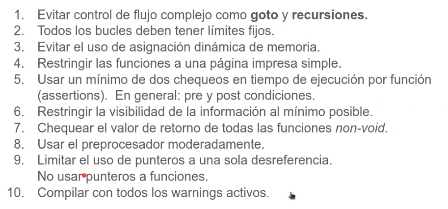

# Clase 02 - 7/03/24

## revision
Primero hizo un arreglo de 3 LEDS
despueshace una inicialziacion

Los vectores suelen servir bastante para este tipo de secuencias

## Programa por Patricio
- primer define un vector implicito

- De esa forma el maximo se se calcula siempre bien
- tambien podria agregar al final del vector un maxLED que entonces ahi vas a saber cuanto mide, pero ese elemnto habria que tenerlo definido, no me gusta
    - Lo mismo podes hacer con un vector
    
- Esta definicion va en el .c o en el .h??? 
    - Si esta en el punto h significa que es algo publico que digamos. Digamos que alguien puede incluir el .h y entonces va a tener eso disponible
    - El .c es para lo "privado" a lo mejor
-

# Repaso de C
- para c solo necesitamos un compilador y existen para casi todas las arquitecturas
- Es de middle-level de asbtraccion, igual en rigor es de alto nivel, bajo nivel es assembly
- En c esta la filosofia de  "el programador sabe lo que esta haciendo" por eso punteros y acceso a memoria
- C es mucho mas confiable escalable, etc que assembly, peeero con assembly podes lograr mas eficiencia (es medio relativo)
- Igual la eficiencia de los compiladores estan muy optimizados hoy en dia y los micros estan muy sobredimensionados, entonces no hay tanto problema 

## caracteristicas
- imperativo -> basado en sentencia
- compilado -> no corre en tiempo de ejecucion
- estructurado -> basado en bloques de codigos
- debilmente tipado -> hace referencia que te hacer operaciones con distintos tipos, por ejemplo una operacion entre int y float

- El C90 es importante para cosas criticas, porque uno usa un compilador compatible con el standar

## tipos de archivops
- .h -> archivos de encabezamiento
- .c -> fuente
- .o -> objeto, es el archivo porcoesado, donde el linker junta librerias y los objetos para hacer el ejecutable
- .elf -> binario ejectutable, lo que bajamos a la placa

## etapas de compilacion

Todas estas etapas son configurable. Algunos errores tiene que ver con las optimizaciones. por ejemplo una variable volatile indica que NO tiene que ser optimizada

## Anotaciones random

- #include es un copy paste. con <> lo va abuscar al pad por defecto del proyecto, las standar. En cambio con comillas, lo va a buscar al pad del proyecto

Esto para debugear

Lo malo de esto es que aumenta la complejidad del codigo

- diferencia entre break y continue, el continua cortas UNA iteracion, el break te saca de todo
- goto, se suele decir que esta PROHIBIDO su uso, por malas practicas. Esta en el codigo de kernel, asi que tiene sus virtudes. En general no hay que usarlo, peeero si sabes usarlo, vale. El tema es que genera el efecto spaghetti porque es dificil de sguir, porque puede saltar a cualquier lugar. Un buen uso es para control de errores. Otro es por ciclos muuuy profundamente anidados y en vez de poner break break break, sino poner un goto

- una maquina de estados va con switch o if es mucho mas legible pero tenes que recorrer todos los estados, pero se soluciona con punteros a funciones generalmente peeero es mucho menos legible

- La cantidad de bits siempre depende del compilador y la arquitectura, generalmente elint suelen ser 32 bits
- tipos de datos siempre se cumple que

- Hay tipos de datos stanmdar para que sean independiente de la arquitectura del compilador

    - eso logra la compatibilidad

- cuando uno hace una sentencia de comparacion, si es 0 es false, si es distinto de 0 es verdadero

- casteo cambiamos temporalmente un tipo de dato a otro.

## Buenas practicas
- No es posible que este 100% de error, esto solo lo reduce
- adoptar un codigo estilistico y RESPESTARLO (no mezclar), esto es un formato nomas
- en el codigo documentar el POR QUE y no el como
- En el punto h se documenta mas a tipo usuario mas a la estructura o llamada de la funcion y en el .c mas para desarrolladores

### Resumen de buenas practicas

### 10 reglas, son recomendaciones

- obviamente se pueden obviar, si uno sabe lo que hace, peero eso minimza errores
- Chequear lo que se devuelve de las funciones
- evitar punteros dobles
- evitar numero harcodeados
- es mejor una constante simbolica que una macro
- La mejora de la constanste simbolica es mejor para el caso de chequeos, ya que si sse la asigno un numero a un puntero chilla

### MISRA C

# Practica 2
hacer el punto 2 pero parpadeando con un periodo distinto

mandar el link del repositorio
subnir la practicfa
hacer la revision de pares