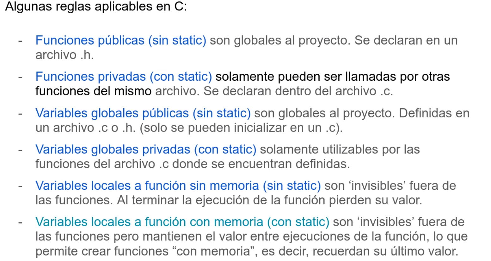

# Clase 03 - 14/03/24 - Modularizacion

# Repaso de C
## Modificadores
- Static
    - Si es una variable global, la hace privada entonces solo se puede ver dentro mdel archiv
    - si es variable local, hace que se posea una memoria fija y conserva su valor entre llamadas
- Volatile indica al compilador que no debe apicar optimizaciones de codigo ya que esto puede cambiar su vbalor poruna accion externa al sw, comoo periferico o interrupcion
- const no se puede cambiar su valor, se guarda rn ROM
- register, la variable sea alocada en un registro
- extern, variable declarada en otro archivo

## Arreglos
En memoria CONTIGUAS

## Punteros
pasar por referencia optimiza el uso de memoria

# Modularizacion
## Objetivo 
- Calidad de software
- divide y venceras, dividir el modulos, donde esos modulos tiene funcones que resuelven una misma problematica (esto es subjetivo)

## Separacion
- Separar codigos en .c y .h
- lo privado es el .c
    - funciones
    - prototipos de funciones privadas
- lo publico es el .h
    - prototiopos de funciones publicas
- La HAL hace mucho uso de estio

- La clase va a ser el archivo

- El extern se usa para variables, que se usa en otro archivo. Esto no nos gusta mucho porque ROMPE la modularidad y ademas cause inconveniente en sistempas operativos apropiativos
- PAra esto se suele hacer seter y geters
- La idea es usar variable privadas y asi usar funcion de read set para que lo suen los dew afuera