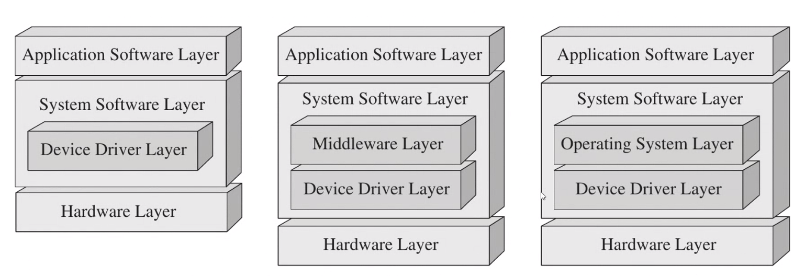
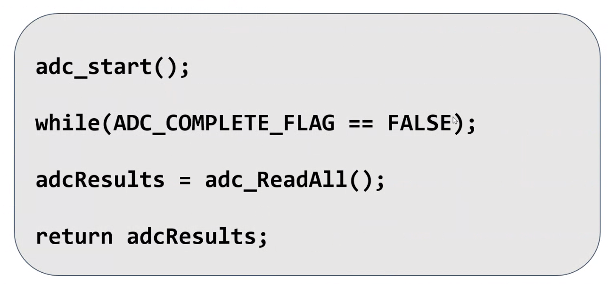
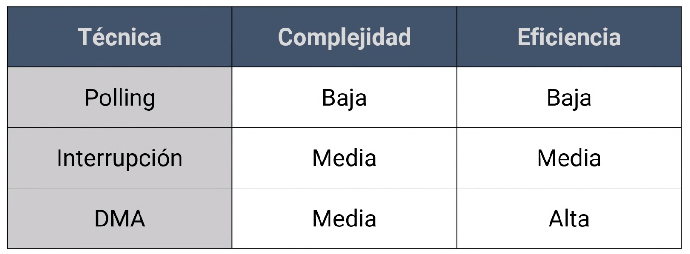
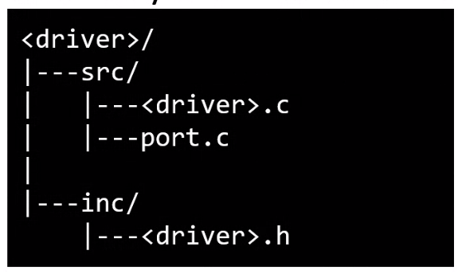
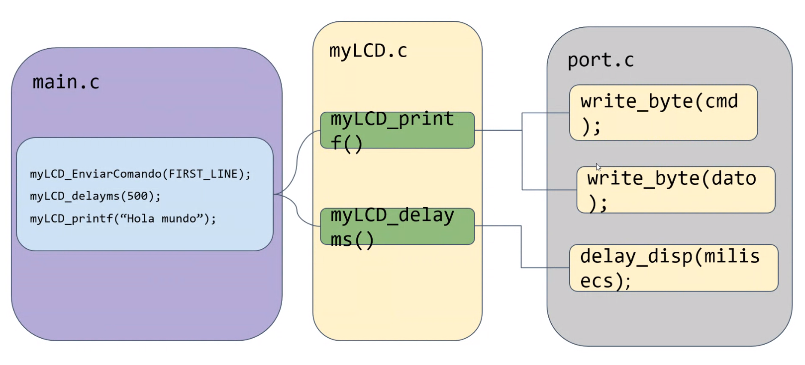
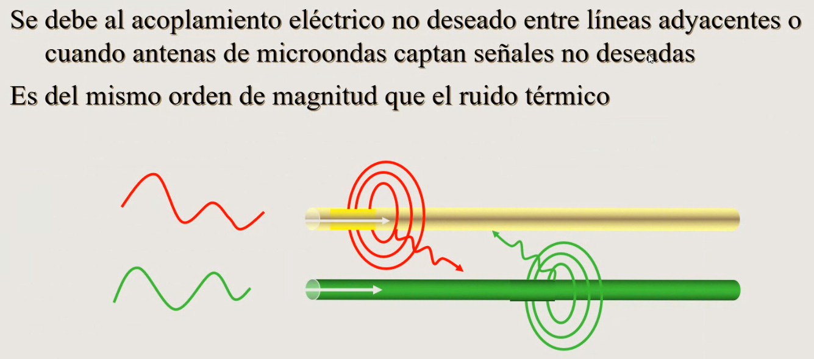
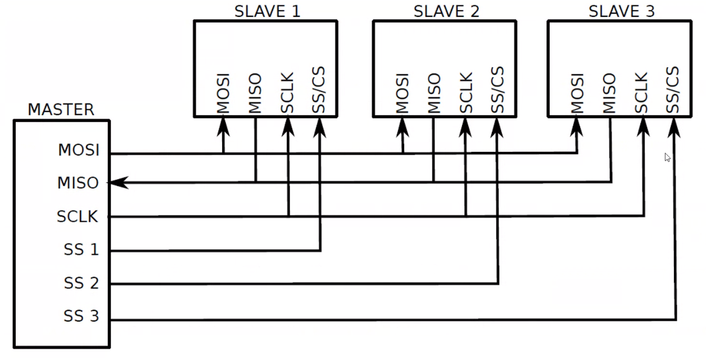
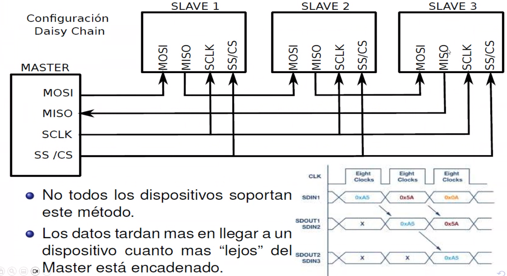
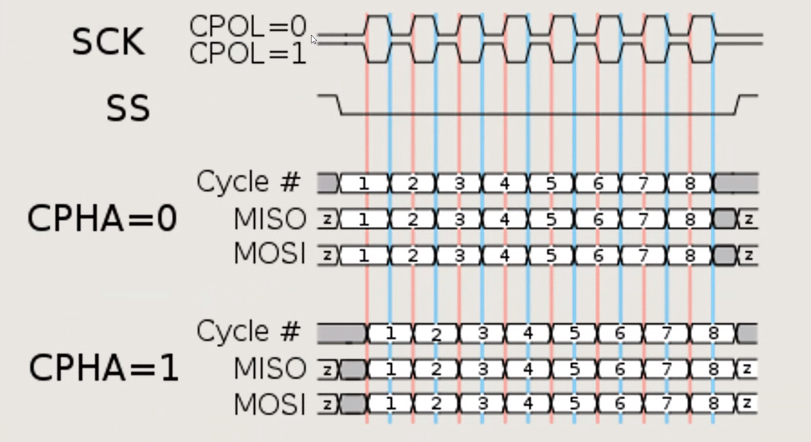
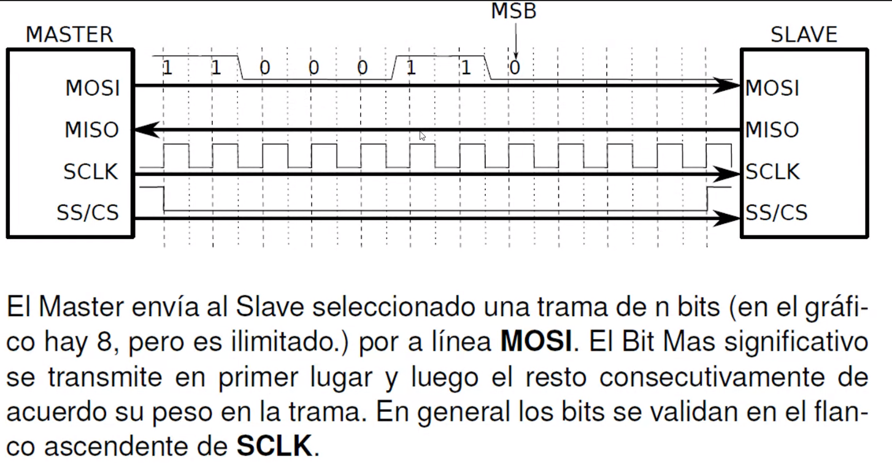

# Clase 02 - 09/03/24

el IDE de STM te permite hacer en C++

# Device drivers

- El sw que interactura directamente con el hw y lo controla se denomina **device driver**
- Hay cosas que igual que estan abstraidas por el FABRICANTE mediante la HAL. Es nuestra maxima interacción con el hw, nos montamos sobre esa capa para montar nuestros drivers
- Los drivers son BIBLIOTECAS que inicializan el hw
- Dan soporte y datos hacia la capa superiores
- hace de vinculo entre el SO y el middleware o entre la capa de aplicacion y hw

- Nosotros vamos a usar principalmente el de la izquierda o a lo usmo el del medio, por lo menos por ahora
- Uno siempre espera que un dirver que sea portable, peeero siempre en algun momento va a fallar, en algun caso vas a tener que modificar algo. Por eso nunca se debe asumir que va a funcionar. Por eso por mas similar que parezca siempre chequear el hw
- Los driver se dividen en los que son:
    - Especificos de la arquitectura: gestiona el hw que esta integrado en el proesador principal, estos generalmente ya estan implementados por el fabricante. Ej inicializacion de memoria, FPU. Generalmente los dejamos como estan
    - Genericos: es el que gestio el que esta en el PCB, fuera del microcontrolador. Igual siempre tiene porciones de codigos especificos de la arquitecrtura. Es imposible disociarse al 100% de la arquitectura. Todo lo que no tenga relacion con el hw la idea es que quede separado asi puede ser portable
- Los mircos tienen la posibilidad de acccedes a codigos privilegiados o no.
- En los Cortex-M los modos de ejecucuion son privilegiados y no privilegiado (usuario)
- Generalmente drivers son privilegias
- Nosotros trabajamos en bare-metal, osea sin SO, directamente a la HAL

## Tecnicas de diseño
- Polled driver: drivers por encuestas
- interrupt driven drivers, 
- DMA driven drivers, por acceso a DMA, por acceso directoa la memoria

### Polled driver
- Es la mas sencilla y fundamental
- Hace un poll del periferico o dispositivo externo para saber si puede interactuar
- Generalemente solop hacen un poll de un flag, generalmente un bit
- Ventaja: es sencillo
- Desventaja: es crtitica la periocidad con la que consulto, puede ser bloqueante, hay que ver cuanto consulto, cada cuantot iempo, que es lo que controlo porque el tiempo es critico. Generalmente NO es de los mejores metodos para ahorrar energia

- ejemplo de algo que esta constantemente mirando 

- Estoy siempre encuestando, pero no me puedo ir a dormir, si puedo hacer cosas en el while durante, peero tambien no puedo hacer tanto para no perder tanto tiempo hasta ver el flag
- Son drivers bloqueantes
- Se podria en vez de un while, que retorne algo y haya una aplicacion que haga un polling del driver, y de esta forma el driver no es bloqueante. Ahi ya elije el usuario como leerlo y el termina decidiendo si hace algo bloqueante o no, y si espera un poco mas para leerlo
- Es ineficiente

### Interrupt driven driver
- Mucho mas eficiente, pero es mas complejo
- Se puede dejar al micro haciendo nada, lo cual ayuda mucho al consumo 
- Interrupcion: evento que desencadena que se realice/ejecute una parte de codigo
- Puede ser basados en interrupciones de:
    - Orientados a eventos: algun error, alguna deteccion de algo, algun mensaje, etc
    - Segun algun cronograma (scheduled): un timer que interrumpa cada cierto tiempo
- Hay que tener cuidado con los timers porque puede generar que algo se quede siempre en una interrupcion

#### Buenas practicas
- Interrupciones lo mas cortas posibles. Cortas en EJECUCION, no en lineas de código, ejemplo un printf implica muchisimo
- Declarar variables que se compartan como **volatile**. Esto es para que el compilador vaya a buscar a la variable cada vez que la tiene que encuestar y que no optimice. Por ejemplo si pregunta algo que sea false y ve que nunca se cambia podria optimizar y listo. OSea es decirle no lleves a cache (memoria donde se van guardando los resultados) el valor, sino que le dice que cada vez que hagas la cuenta, que vayas a buscar el valor a memoria y no que sea acuerde el valor. 
    - Todas las variables relacionad con hardware deberian estar con volatile
- Gestionar datos/tareas de alta prioridad y luego pasar la carga de proceso a la aplicacion. Osea solo hacer en la interrupcion lo importante., despues en el codigo principal

El ESP32 tiene un freeRTOS que esta ahi corriendo. Lo que le paso a Pablo es que hay un scheduler que lo sacaba de la interrupcion que era muy larga.

- Las interrupciones tiene que ser muuy cortas, dejar algo que despues en el programa principal lo gestiones, marcanun flag, hacer algo en memoria, algo que sea poco.

### DMA driven driver
- Utilizan acceso directo de memoria
- Puedo hacer que el periferico gurade directamente los datos en la memoria en un estilo de buffer
- Esto hace que mi flujo siga por otro lado y que se procese cuando ese buffer ya este listo o se diga de ya leer la informacion
- No pierdo tiempo
- Me aseguro que esos tiempos fueron guardados casi al mismo tiempo
- Tiene gran ventaja e el tiempoe en que tardo en capturar los datos (el throughput de datos)
- Osea los datos se van directo a memoria sin la intervencion del CPU
- Los drivers/controladores DMA puede3n mover datos de estas manera:
    - Periferico a memoria
    - memoria a memoria
    - memoria a periferico
- Los micros tienen numeros LIMITADOS de canales DMA

## Resumen

- Generalmente se hacen en interrupciones, uno encara para lo medio

# Propuesta de la materia
- Implementar driver del tipo generico, es decir para hw fuera del micro
- **Utilizar codigo reutilizable**
- Obviamente una pequeña aprte es implementada por hw

Se propone dividir en
- <driver>.
- port.c, este es el que llama al hardware en cuestion, el driver utiliza esto para llamarlo. Esto es lo quehay que cambiar si tengo que cambiar el hardware. Van a ser cortitas, ya que solo van a llamar a la HAL. Aca van los **wrappers**

- La matyoria de las de port.c deberians ser staticas

# SPI
HAY TRABAJO PRACTICO DE SPI
Es del 8/03 al 23/03

## Modos de transmision
esto es mas general no de SPI. Dependiendo el flujo de informacion entre emitir y recibir ese llama de distintias formas. Puedeo tener, emisor, receptor o transceptores.

- Simplex: un unico sentido, el transimsor le transimte al emisor, ejemplo la radio tradiodcional, uno transmite y la radio recibe
- Half-duplex: En ambos sentidos pero NO SIMULTANEAMENTE. Ejemplo radios de comunicacion los walkie-talkie
- Full-duplex: En ambos sentidos y a la vez. Ejemplo siostema de comunicacion telefonica

- Todos los protocoles que hablamos son protocolos seriales
- La paralela es que tengo tantos cables como bits quiero transmitir. El problema de esto no es solo la cantidad de cable,s ino que a mas frecuencia es mas dificil porque los cables se empiezan a trabajar con antenas. Ademas puede llegar ondas desfasadas
    - Diafonia o crosstalk: a partir de cierta frecuencia ya empieza a recibir y transmitir 
    
    - Tambien existe la diafonia 
- Osea el paso de paralelo a serie no es tanto por la cantidad de cables sino porque en un momento ya no se puede aumentar la velocidad en la comunicacion paralela

## SPI - Serial Peripheral Interface
- es un bus para efectuar comunicaciones M2M machine to machine
- Se suelen utilizar para algunas memorias, sobretodo las SD (con algunas variantes)
- Es protocolo tipo serial
- Es Sincronico: utiliza clock para sincronizar los dispositivos (hay nuna linea de clock entre ambos dispositivos)
- Es Full duplex, igual puede funciona como half-duplex
- El i2c medio que le gano el terreno
- NO HAY STANDAR DE SPI, pero la gran mayoria tienen un modulo SPI y mas o menos coehexisten entre si
- No posee mecanismo de ACK ni direccionamiento de dispositivos. Osea solamente manda informacion y listo, no se fija si llego ni tiene nada para corroborar que llegue
- La info suele ser de 8 o 16 bits hasta velocidad de 10 Mbps, perio lo tipico es 1 Mbpps

Se comunica mediante registros de desplazamiento, va rotando la infromacion bit a bit. se va moviendo la infromacion. Se puede hacer hasta sin micro, con compuertas y flip flop ya se podrias hacer
- MOSI: Master Output Slave input
- MISO: Master Input Slave Output
- SCLK: Slave Clock, sale siempre del master
- SS: Slave select, es para seleccionar un esclavo especirfico para hablarle. Suele venir negado. Esta es la mas controversial la que los fabricantes cambian mas

SIEMPRE se hace un intercambio de bytes o no, tengo que ver si esa informacion que viene es importante o es simplemente basura

- Se requieren 3+N para conectar N dispositivos
- A veces se usa el Daisy Chain
    
    - Es medio raro usarlo pero se puede usar, pero tener en cuenta que si se quiere decir algo al slave 3, esa info pasa por los slaves anteriores
    - Es algo piola para los Neopixel, entonces con un solo pin podes usar N leds (igual NO es SPI)
- Por cada pulso de clock, el master y el slave envian un bit
- Todo siempre lo controla el master el inicio, ya sea para recibir o para transmitir
- Existe 4 MAN#ERAS de tomar datos validos en la comunicacion SPI. Generlmente los micros se pueden usar las 4, pero los slave suelen tener solo una

## 4 metodos
- Tiene que ver de la polaridad y fase de como leo la informacion

- El clock puede estar normalmente en 0 o normalmente en 1, eso es la polaridad, osea si esta siempre en 0 o siempre en 1 en estado bajo
- Tambien se puede  determinar si la informacion hay que tomarla en flanco ascendente o descendente. Eso es la FASE

- 00 -> sla info se toma en el flanco ASCENDENTE
- 01 -> La info se toma en el flanco DESCENDENTE
- y sigue

- Fijate que si le pifio no se comunica ya que es justo la transicion
- Esto es una limitacion claramente para conectar en cadena ya que si son diferente en polaridad y fase eso te caga

- No hay standar, a veces se transmite el MSB y otro el LSB

## Generalidades
- No hay nada definido
- La tasa no esta definida
- No hay direccoionamiento
- No hay mecanismo de ACK
- El master NO tiene conocimiento de haya slaves presentes. Esto lo determina la app
- Son señales paralelas asi que deberia ser para distancia cortas. Ya que el cable y distancias largas, hay que poner ya inmunidad al ruido (como mallas o par diferenciales) por ejemplo en USB

### Ventajas
- El mas sencillo
- Hw muy simple, con un shift register ya esta
- mucho mas rapido que la UART
- Se pueden conectar varios dispositivos

### Desventajas
- Para varios slaves ya es un poco molesta e inmanejable, se puede usar un deco igual
- Al no haber standar tengo que leer las hojas de datos de cada master y slave
- No es multimaster, por ejemplo una SD NO podria leerla desde 2 micros

# TP1
- Buscar algun dispositivo que sea SPI
- Detallar un poco el dispositivo, algo breve
- Identificar tiempo en una tabla
- Buscar en la documentacion de STM, de la HAL, cuales son las funciones de lectura y escritura de SPI, poner las mas importante y explicarlas, no poner todas todas. poner breves, 
- CS = chip select