# Clase 03 - 16/03/2 - I2C 

- Diseñado para conectar dentro de una placa, como si es la UART
- Bus simple y bidireccional. Tiene dos lineas
    - SDA
    - SCL 
- philips ahora es NXP
- Es la utlima version de I2C

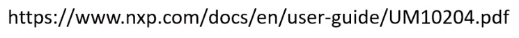

- Tiene la posibilidad de trabajar multimaster. Tiene un protocolo para esto, un arbitraje
- Es sincronica
- CADA I2C se identifica a traves de su propia diureccion. No se reconoce por HW como el SPI
- Osea aca a partir de la direccion uno puedo elegir en el bus
- I2C = TWI = Two wire Interface, es por un tema de licencias, igual ahora esta liberado

## Hardware

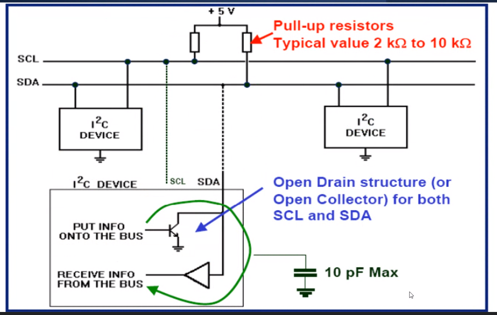

- Uno va a tener el bus de conexion que se ve ahi SCL y SDA
- Hay una capacidad tambien por la linea
- Cada dispositivo tiene un transistor, como una llave, que cierra el circuito, y de esa forma como siempre tiene un 1 por el pull up, entonces cuando cierra el transistor tenemos un 0 en esa linea. 
- ES DECIR, los dispositivos SOLO dicen cuando una linea se pone en 0 PERO NUNCA mandan un 1
- Si no estan esas resistencia de pull-up basicamente nunca tienen un 1 entonces nunca funciona. Generlamente todo ya tiene esas resistencias incorporadas. En el LCD por ejemplo, el modulo I2C que se conecta ya tiene las resistencias de pull-up
- En un principio si uno conecta muchos , puede ser que ese pul-up baje mucho por el paralelo de la resistencia, en principio uno no conecta mas de 4 dispositivos entonces no hay problema, pero podria serlo
- Tambien hay que tener que hay una capacidad maxima que limita a las velocidades

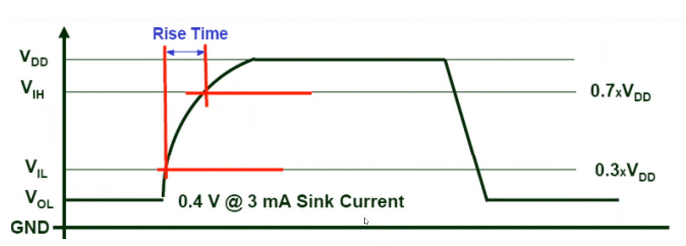

- Entonces tengo un limite a cuanto capacidad puedo conectar por esa capacidad y resistencias propia de los componentes. Esa capacidad es parte de todos los componentes. El protocolo dice una capacidad maxima de 10 pF, despues cuada uno va a poner lo que quiera
- La velocidad no llega a MHz ni en pedo
- Siempre va a depender de esos transistores
- OJO con la distancia
- Los cable arduino o dupon son cables MUY berretas 

## Como funciona
- Es sincronico, pero esta establecido como uno quiere iniciar, es decir condiciones de start y stop

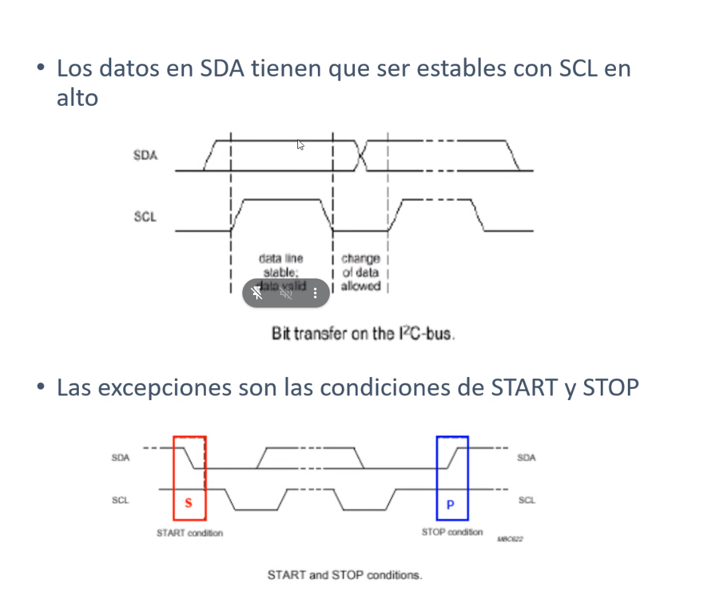

- Condicion de start: mantener el clock en alto y transicionar a abajo el SDA
- Condicion de stop: SCL en alto y transicionar SDA de bajo a alto
- Todo lo del medio es data

### Direccionamietno de I2C

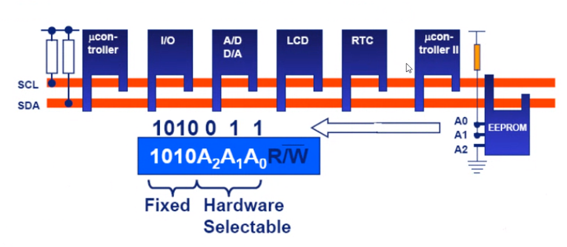

- Suele ser hibrida, es porque la direccion tiene parte fija que depende del dispositivo, y despues tiene una aprte por hardware que la hace seleccionable
- El mmodulo I2C de las pantallitas tienen para cambiar los bits de A2 A1 A0

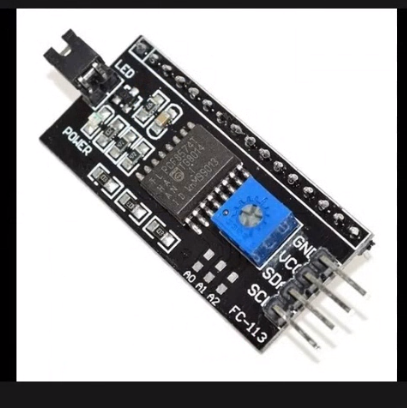

- Si pongo 2 LCD las puedo cambiar, entonces si quiero poner 2 pantallitas etnocnes puedo diferenciarlas por esa. Entonces solo puedo poner 8 pantallitas por ejemplo pórque solo tenggo 3 bits
- Memoria 21203, nada sirve nomas para ver la hoja de datos 
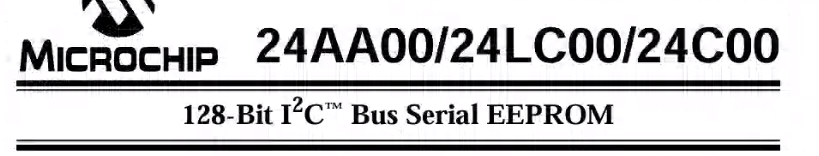
- Los primeros cuatros bits es por dispositivo
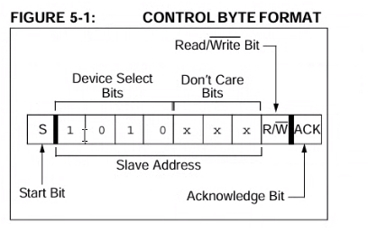

- Ver el ds1307, el ds3231 es mas preciso, es un RTC

### Formato de 7 y 10 bits
- Casi todos son 7

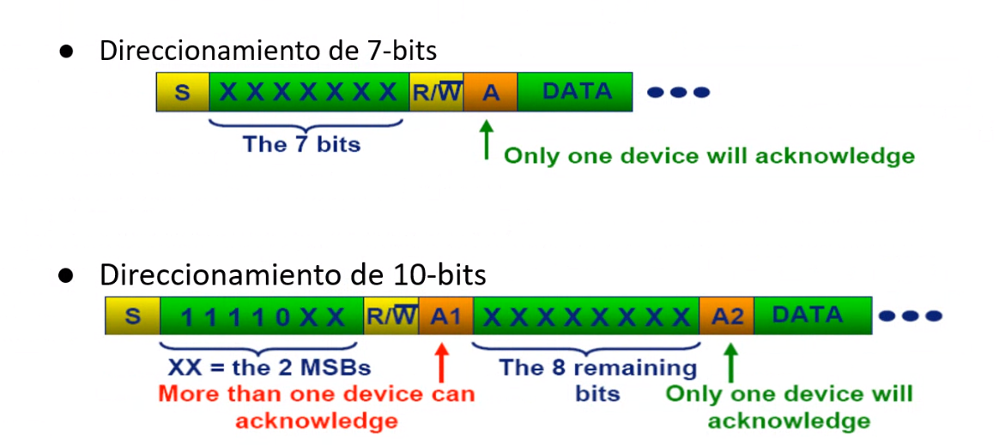

1. Primero bit de start 
2. La direccion
3. si voy a leer o escribir
4. viene el ACK
5. data

- En el caso de 10 bits, como las tramas son de 8 bits, entonces hay que mandarlo de dos partes y ojo que ahi puede ser que dos dispositivos manden ACK

### Analizador logico
Vamos a ver señales cuadradados, osea es para analizar las tramas

## general para escritura y lectura
ojo con el slave addres en la hal, porque si la adres es 0x27 seria 0100111. PEEERO como esta el bit incluide de R/W en realuidad hay que mandarle lo mismo desplazado un bit, osea 0100111x

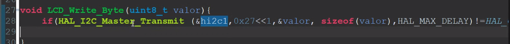

Por eso hace 0x27<<1

Esto es por como esta hecha la Hal, nada mas

## Lectura de dispositivo slave
- Osea la data no es la data en si, es la data que necesite el sensor. OSea hay que tener en cuenta que es data para el sensor. Osea para I2C todo lo que no es direccion es el dato, pero no necesariamente por ejemplo es el dato de temperatura, a lo mejor el senosr manda numero donde dspues el master tiene que hacer cuentas.

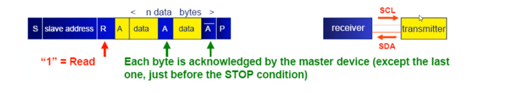

- Siempre es un byte de informacion, y mientras que el MASTER le de los ACK (A azul) el otro le va a seguir mandandno
- el NACK o A negado, es couando vamos a frenar.  Es el Not Ack
- Siempre nhay bytes de control y eso, pero eso es del DISPOSITIVO NO del protocolo

## Escritura de dispositivo slave
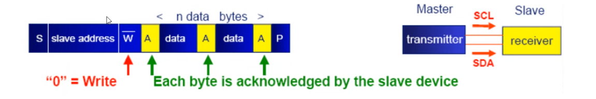

### Para el tp
cuando pide secuencia de escritura y lectura pide esto
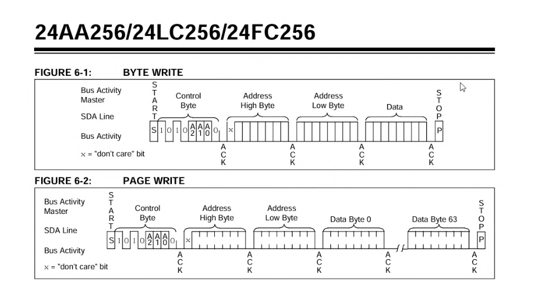

La HAL transimit se encarga de todo, si pones 10 bytes lo manda 10 bytes no es que hay que mandar uno por 1 en el driver

## Acknowledge
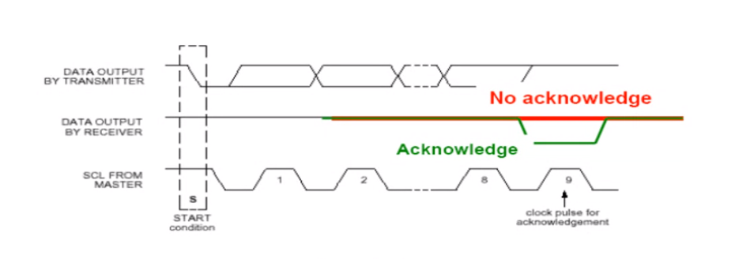

- Se da en el noveno bit y es OBLIGATORIO
- ACK Es un 0
- NACK es un 1
- Para nosotros el ACK es transparente

## Arbitraje
- Es una comunicacion multimaster por lo cual se puiede dar que varios master quieran tener el control de la linea
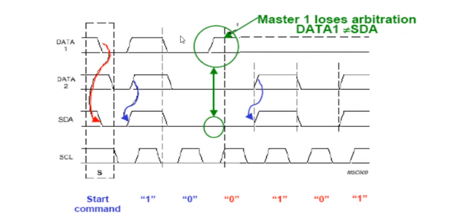

- Aca ase ve que los DOS hacen el start, osea ninguno de los dos se va a percatar que perdieron la linea
- al transimitir un 0 no hay problema
- Pero cuando quieren poner un 1 y el otro un 0, ahi claramente uno se va a dar cuenta que no puede transimitir y ahi libera y se da cuenta
- Generalmente el que ghana es el que  tira abajo la linea. Entonces en este caso gano el master 2. El master 1 se da cuenta y libera la linea

Hay otra tecnica quie es el clock Stretching

### Clock Stretching

Osea que el slave tome la linea de clock en bajo y entonces el master medio que se para y espera para que el esclavo le diga al master que me esta haciendo muy rapido. Es como para darle un aviso. Es una implementacion transparente para nosotros. Es algo propio del protocolo

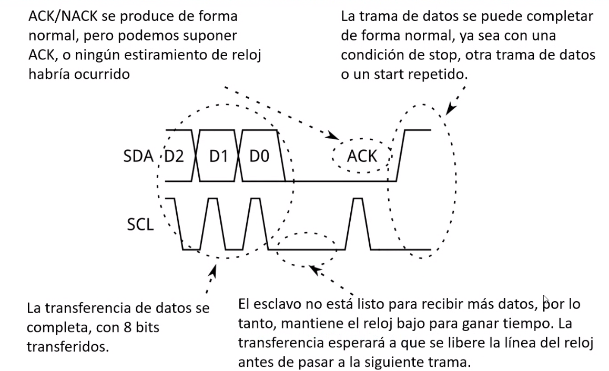

La funcion de la HAL tiene un timeout, ese timeuout es cuanto tiempo le doy para que tenga exito mi transmision

